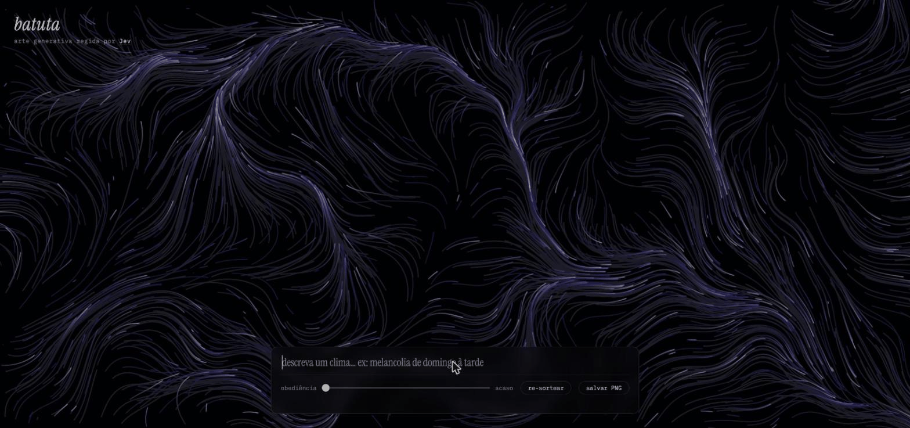
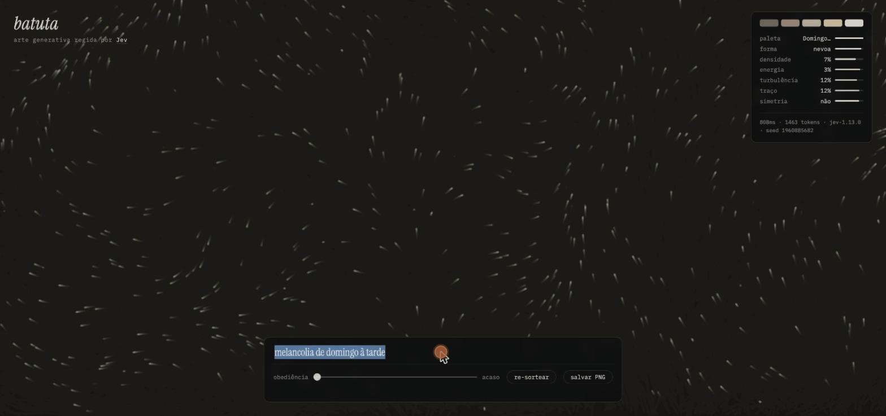
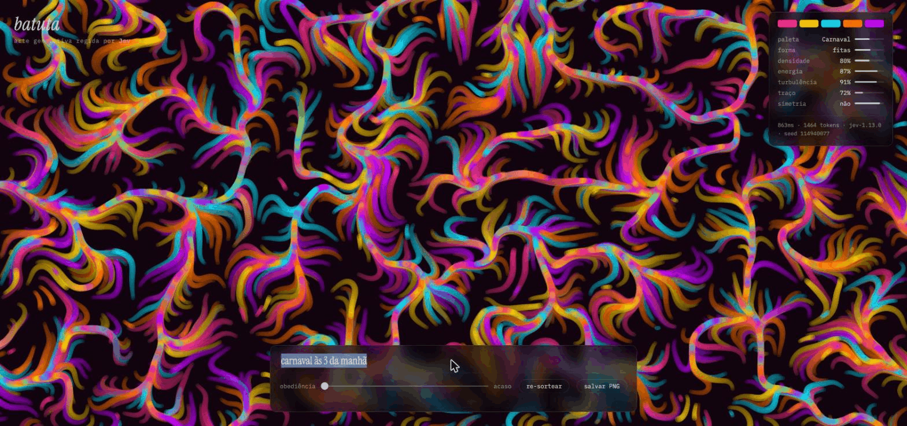

# batuta

Generative art **conducted** by [Jev](https://typesafe.ai) — TypeSafe AI's
System One model. You type a mood in Portuguese or English ("melancolia de
domingo à tarde", "carnaval às 3 da manhã") and a flow-field artwork repaints
itself to match. Jev never draws a pixel: it is the conductor, not the brush.

## Gallery

Three phrases, three artworks — same code, same model, different conducting:

**"melancolia de domingo à tarde"** → palette *Domingo à tarde*, névoa, density 7%, energy 3%:



**"carnaval às 3 da manhã"** → palette *Carnaval*, fitas, energy 87%, turbulence 91% — then the
slider goes to *acaso* and one re-roll samples a symmetric *Neon na garoa* from the same
distributions, no extra API call:



**"haicai escrito à tinta num papel antigo"** → palette *Tinta e papel*, filamentos, everything
near minimum — ink strokes on old paper:



## How it differs from the Jev pixel-painters

Projects like jev-paint and typesafe-image-diffusion use Jev *as the image
generator*, one decision per pixel. batuta inverts the relationship: a rich
algorithmic system (thousands of particles in a fractal-noise flow field)
draws by itself, and one batched Jev call decides its **typed direction**:

| Question | Primitive | Drives |
|---|---|---|
| paleta | `Choice` ×12 | curated color palettes with evocative Brazilian moods |
| forma | `Choice` ×4 | filamentos · fitas · estilhaços · névoa |
| densidade, energia, turbulência, escala | `Score` ×10 levels | particle count, speed, field chaos, stroke weight |
| simetria | `Noul` | mirrored composition |

One call, ~1.4k input tokens, ~$0.00006, ~500ms.

## The obedience ↔ chaos slider

Jev answers with full probability distributions, and the slider decides what
to do with them:

- **obediência (0)** — every parameter takes the argmax / probability-weighted
  mean: the model's most likely reading of your phrase.
- **acaso (1)** — every `Choice` and `Score` is **sampled from the returned
  distribution**: Jev's calibrated hesitation becomes the artwork's chance.
- in between, the distribution is tempered (`p^(1/chaos)`) before sampling.

Because the distributions arrive with the answer, **re-sortear** produces
endless variations of the same phrase with *zero additional API calls* — the
randomness was already paid for. A deterministic seed (shown in the panel)
makes any variation reproducible.

## Running

```bash
npm install
echo 'TYPESAFE_API_KEY=your-key' > .env
npm run dev   # proxy on :8788 + Vite on :5174
```

Type a phrase, press Enter, drag the slider, re-roll, save PNGs.

## Layout

- `src/questions.mjs` — the conductor's vocabulary: palettes, shapes, and the
  seven typed questions (shared by proxy and browser).
- `src/conduct.ts` — pure obedience↔chaos machinery: tempered sampling,
  score normalization, seeded PRNG. Vitest-covered.
- `src/field.ts` — the flow field: fbm noise, particles, four shape dialects.
- `server/index.mjs` — minimal proxy keeping the API key server-side.

## Verified behavior (jev-1.13.0)

"melancolia de domingo à tarde" → palette *Domingo à tarde* (p=1.0), shape
*névoa* (0.92), density sparse, energy near-still, asymmetric. "carnaval às
3 da manhã" → palette *Carnaval*, high density/energy/turbulence. The
conductor listens.
